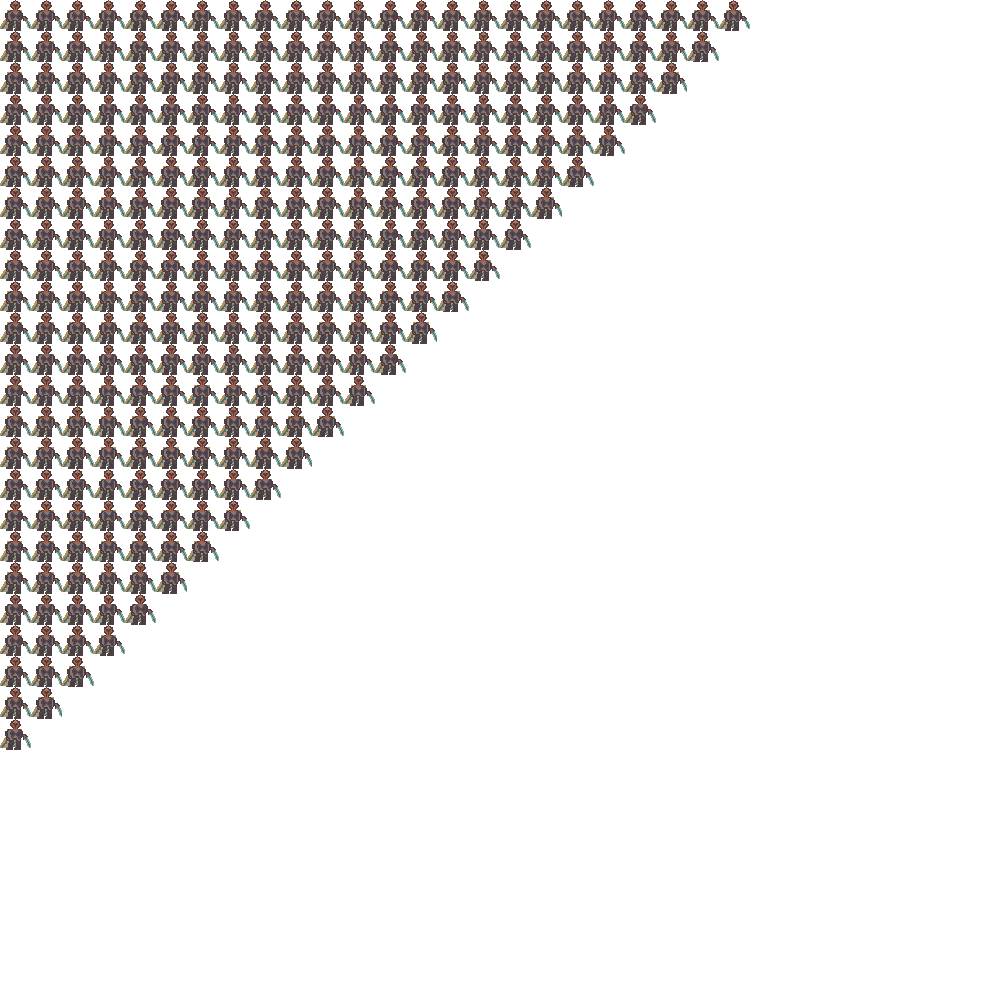
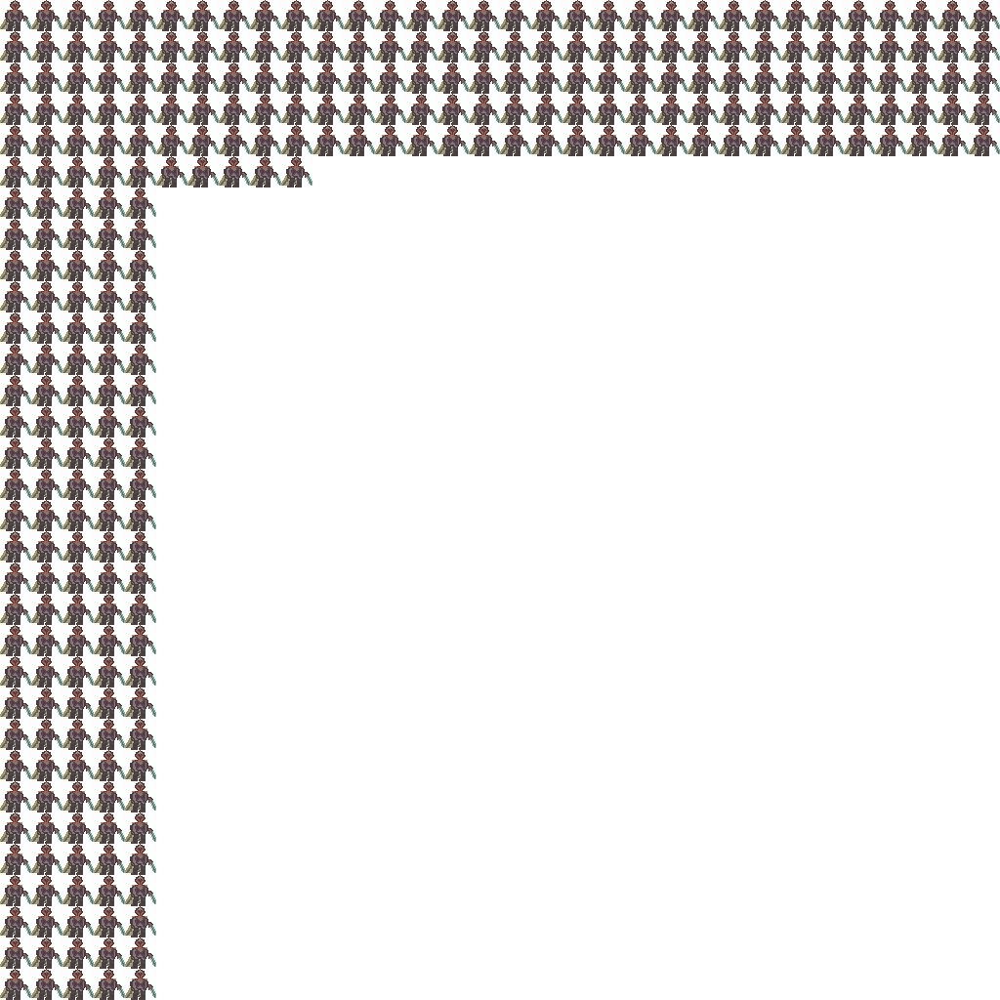
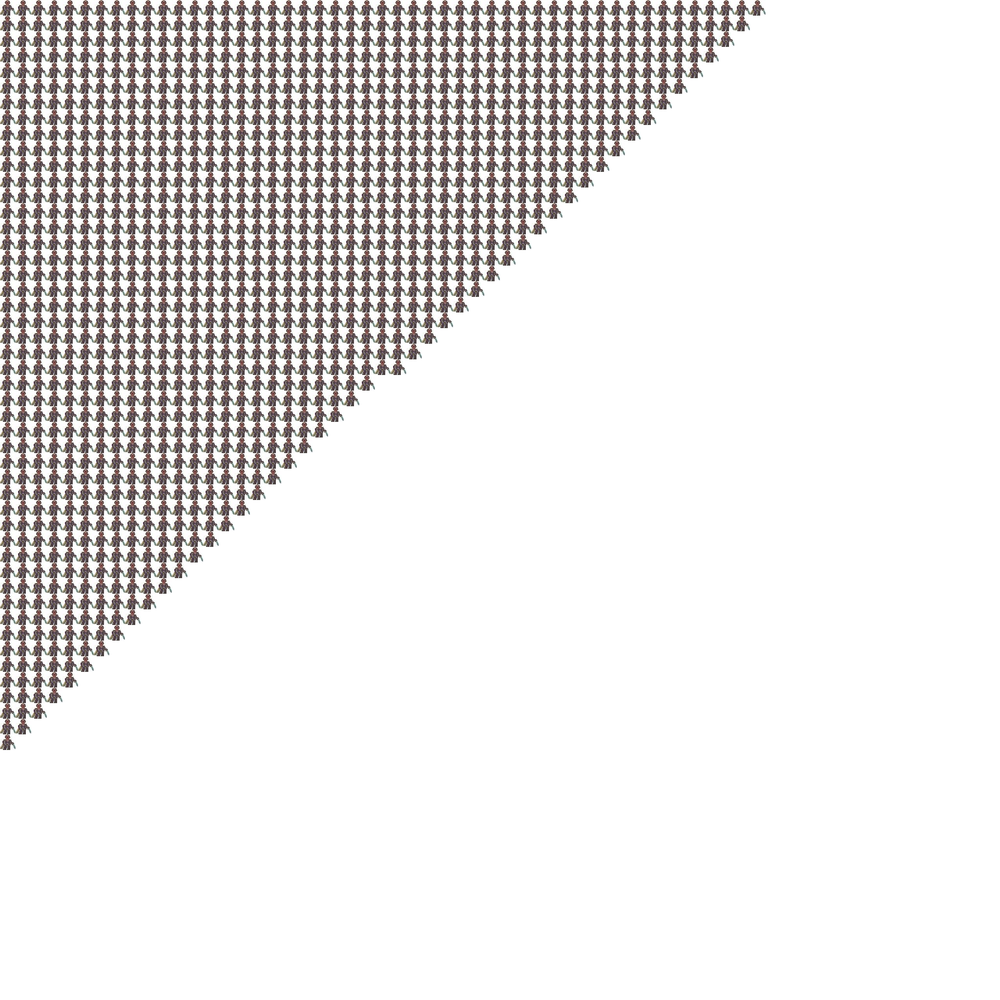
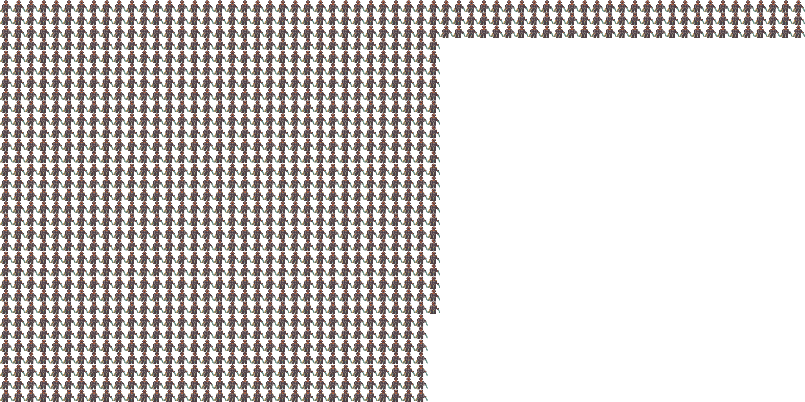

# silly_packer

Silly Packer is a texture packing internal tool developed for silly_survivors.

## Output Header

The output header contains the following in a namespace, these are the symbols
available to you with all options set to default and you only provide input
images _and_ extra files.

| Namespace | Struct | Members     | Notes |
|-----------|--------|-------------|-------|
| `silly_packer` | `atlas_info`          | unsigned int `width`, `height`, `components_per_pixel` | |
|                | `extra_symbol_info`   | void* `data`, std::size_t `size` | Debug option only |
|                | `sprite_info`         | unsigned int `x`, `y`, `width`, `height` | |
|                | `uv_coords`           | float`x`, `y`, `width`, `height` | |

| Namespace      | Enumeration (non-class) | Description | Notes |
|----------------|-------------------------|-------------|-------|
| `silly_packer` | `sprite_indices`        | Names that can be used index into the `sprites` array | For input `random_sprite.png`, generated as `RANDOM_SPRITE`. Also provides `min_index`(always 0) and `max_index` (image inputs - 1 count) values. |

| Namespace      | Variable             | Type          | Description | Notes |
|----------------|----------------------|---------------|-------------|-------|
| `silly_packer` | `atlas`                 | `std::array<std::uint8_t>`       | The full generated atlas array | |
|                | `atlas_properties`      | `atlas_info`                     | Filled structure with information about the generated atlas | |
|                | `extra_filenames`       | `std::array<const char*>`        | c-style string names of extra input files | Debug option only |
|                | `extra_symbol_table`    | `std::array<extra_symbol_info>`  | Raw pointer to std::array and its size stored in an array (intended to be casted) | Debug option only |
|                | `filename_extension`    | `std::array<std::uint8_t>`       | (Extra Input Files) These are generated in the form as exemplified in the variable column, embedded into the header, e.g `-e ambient.glsl` -> `ambient_glsl` byte array | |
|                | `sprites`               | `std::array<sprite_info>`        | Array with individual image/sprite data about its presence in the atlas | |
|                | `sprite_filenames`      | `std::array<const char*>`        | c-style string names of image/sprite input files | Debug option only |

| Namespace      | Function name | Return Type  | Parameters (in-order) | Description | Notes |
|----------------|---------------|--------------|-----------------------|-------------|-------|
| `silly_packer` | `get_sprite_index`        | `int`        | `const char*`   | Takes in a filename and returns the index of that name (to-be used with `atlas`) | Debug option only |
|                | `get_extra_symbol_index ` | `int`        | `const char*`   | Takes in a filename and returns the index of that name (to-be used with extra symbols lookup table) | Debug option only |
|                | `normalized`              | `uv_coords`  | `const sprite_info`   | Returns a `uv_coords` value from sprite metadata | |
|                | `raylib_atlas_image`      | `Image`      | None                  | Returns an atlas `Image` usable with raylib | Raylib option only |
|                | `raylib_atlas_texture`    | `Texture2D`  | None                  | Returns an atlas `Texture2D` usable with raylib | Raylib option only |


> Consider running the generated header through `clang-format`

> If you do not want a namespace simply provide an `""` (empty string) to `-n`

## Dependencies

### Libraries

- [argparse](https://github.com/morrisfranken/argparse)
- [stb_image](https://github.com/nothings/stb/blob/master/stb_image.h)
- [stb_image_write](https://github.com/nothings/stb/blob/master/stb_image_write.h)
- [stb_image_resize2](https://github.com/nothings/stb/blob/master/stb_image_resize2.h)

### Tooling

- CMake
- C++ Compiler with C++20 support

The library dependencies are handled via cmake, and git.
Currently [`stb`](https://github.com/nothings/stb) is handled via git submodules
which is part of the main `silly_survivors` repository.

## Usage

Assuming your input image dimensions are in power of two, simply doing

```sh
./silly_packer -i image1,image2...
```

should work fine. You can fine tune the options by seeing all the available flags
using `./silly_packer -h`

> Silly packer skips over duplicates by default

### Options available

```csv
Usage: silly_packer  [options...]

Options:
      -i,--images : A comma separated list of image files to be packed [default: ]
      -e,--extras : A comma separated list of extra files that can be embedded [default: ]
         -o,--out : File name of the generated header [default: silly_pack.h]
   -n,--namespace : Namespace string under which the symbols will be placed [default: silly_packer]
   -a,--algorithm : Use one of these algorithms to pack: maxrects, guillotine [default: maxrects]
      -r,--raylib : Enable raylib utility functions [default: false]
         -p,--png : Generate an output png image [default: false]
  -d,--duplicates : Allow duplicate file inputs to be part of the atlas [default: false]
          --debug : Export extra symbols that can be used for debugging [default: false]
     -?,-h,--help : print help [implicit: "true", default: false]
```

### Algorithm Selection

**Default: maxrects**

For a small number of images the `guillotine` algorithm works fine.
Anything beyond that, `maxrects` is more suitable for when we have large number of images in terms of runtime and density.

**For 1200, 32x32 images:**

### Guillotine

```sh
./build/silly_packer -e=CMakeLists.txt -n=stupid -o=stupid_atlas.h -r=true     2.65s user 0.10s system 98% cpu 2.793 total
```

#### Maxrects

```sh
./build/silly_packer -e=CMakeLists.txt -n=stupid -o=stupid_atlas.h -r=true     1.03s user 0.08s system 98% cpu 1.131 total
```

| Guillotine | Maxrects |
| ---------- | -------- |
| 300        | 300      |
|  |  |
| 1200       | 1200     |
|  |  |